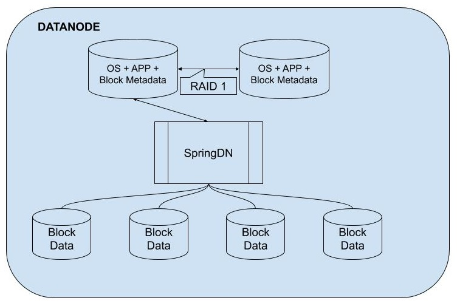
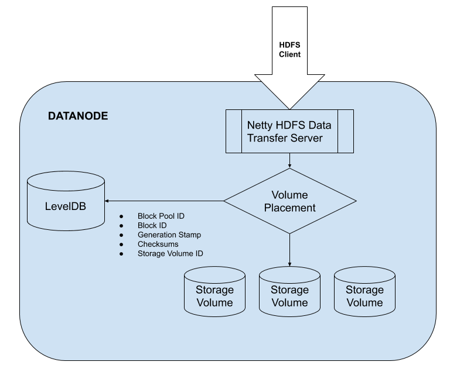
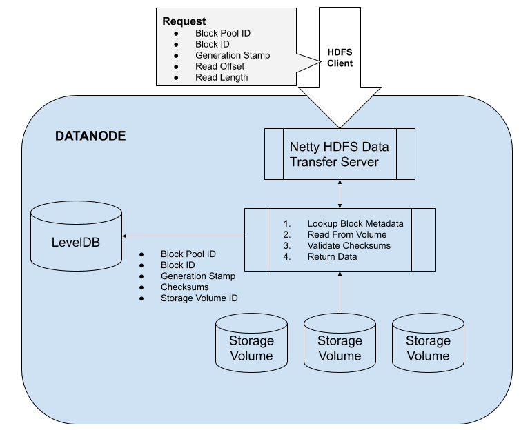

# SpringDN

SpringDN is an alternative implementation of an [HDFS DataNode](http://hadoop.apache.org/docs/current/hadoop-project-dist/hadoop-hdfs/HdfsDesign.html#NameNode_and_DataNodes).

## Objectives

* Built on the modern and extensible Spring Framework
* Service client requests with Netty, an event-driven asynchronous network application framework 
* Store HDFS block metadata on root volume in LevelDB


## Metadata Storage

> Even at normal-person scale (fewer than 4,000 nodes), Hadoop survives hardware failure like a boss but it makes sense to build in a few extra redundancies to reduce these failures. As a general guideline, we recommend using RAID-1 (mirroring) for OS drives to help keep the data nodes ticking a little longer in the event of losing an OS drive.

\- [Cloudera Engineering Blog](https://blog.cloudera.com/blog/2015/01/how-to-deploy-apache-hadoop-clusters-like-a-boss/)

With a standard cluster installation, two drives (RAID-1) are dedicated for the operating system, applications, and logs only.  This leads many cluster administrators to come up with workarounds to better utilize all of the space within their nodes.  Some forgo RAID and designate the second drive as a data drive. Others create a second partition on the two drives and only apply RAID-1 to the primary partition.  The secondary partition is then used to store block data.  This perhaps leads to uneven performance when a block is accessed from a dedicated data drive v.s. another block accessed from the OS-shared disk.

The Apache Hadoop DataNode, stores two types of data to the drives: block data, and block  metadata.  SpringDN seeks to store the block metdata on the primary RAID drives to better utilize the space.



## Requirements

* OpenJDK 11
* Hadoop 3.2

## Running The Application

```
mkdir -p /var/lib/springdn
mkdir -p /data/d1

# edit confg/application.yml

cd <springdn_home>
./bin/springdn start

# running
tail -f app.log

./bin/springdn stop

```

## Health and Status

SpringDn uses [Spring Boot Actuator](https://www.baeldung.com/spring-boot-actuators) for metrics and health status.  The default port is 8080.

```
http://localhost:8080/actuator/info
http://localhost:8080/actuator/health
http://localhost:8080/actuator/configprops
http://localhost:8080/actuator/threaddump
http://localhost:8080/actuator/metrics
http://localhost:8080/actuator/metrics/{metric.name}
```

## Configuration

```
datanode:
  meta:
    # Location for LevelDB databases and other metadata
    home: "/var/lib/springdn"

    # LevelDB read cache size in bytes
    cache: 33554432
  ipc:
    transfer:
      # Port for opening a HDFS transfer protocol socket
      port: 51515
  storage:
    # Specify the storage groups
    # The single 'default' group is appropriate for setups which only use
    # HDDs. For mixed environments, add additional storage groups
    groups:
      default:
        description: "Default location for blocks"

        # 'directory' is a top-level directory where blocks will be stored for this
        # storage group. All volumes allocated to this storage group should be mounted
        # as a sub-directory. This directory must exist be writeable by SpringDN.
        directory: "/data"

        # The percent amount of space on each volume to reserve for other applications
        reserved: 0.20
  dfs:
    # List of HDFS NameNodes
    # Must be proper URI with 'hdfs' scheme
    servers:
      - "hdfs://127.0.0.1:8022"

# The Web UI port used for health and status
server:
  port: 8080
  tomcat:
    min-spare-threads: 1

# Configuration for health and status
management:
  endpoints:
    web:
      exposure:
        include: "info,health,metrics,threaddump,configprops"
```

## SpringDN Design

### HDFS Write Path

When the client sends a write block request to a DataNode, it includes with it a Storage ID. Traditionally, a Storage ID specifies which drive the block should be written to on the DataNode. However, SpringDN treats this Storage ID as representing a group of drives, not a specific drive. In affect, SpringDN implements a software-level RAID 0. This allows SpringDN to support an environment where drives are deployed in a heterogeneous manner. The specific location, the specific destination drive, is hidden from the NameNode and other clients. This allows the DataNode to dynamically choose the drive on which to store the block.

The exact location of each block is recorded in LevelDB thus removing the burden of maintaining a mapping of blocks to a specific drive from the NameNode.  This allows the DataNode flexibility in choosing the optimal drive to store the data and also allows the DataNode to shuffle data when, for example, a new drive is added to the node. The DataNode can automatically re-balance the blocks without updating the NameNode.

The key to the LevelDB is the tuple (Block Pool ID, Block ID, Generation Stamp).  Stored within each record is the location of the block, creation time, the size of the block, and checksum information.

In the current Apache implementation, checksums are stored in a file which is maintained on the same volume as the block.  This allows the application to seek to a particular checksum in the case that the client is reading only a portion of the block.  Without splitting the checksum into different LevelDB keys, there is no way to seek to a particular offset in the LevelDB value, the value is loaded in its entirety. However, block information and  checksum information can be cached within the [LevelDB read buffer](https://github.com/google/leveldb/blob/master/doc/index.md#cache) to improve performance.  In Apache Hadoop, checksums are stored in a ratio of 1 checksum per 512 bytes.  This implies that every 512 bytes of raw data requires 4 bytes of checksum.

A typical server may have 10 HDD each storing 4TB.  It is also typical to reserve 20% of each drive for computational programs to use.  Therefore, to store the checksum data would require:

```
((10HDD * 4TB) * 0.80) = 32TB DFS Storage
(32TB / 512B/cs) = 68719476736cs
68719476736cs * 4B/cs) = 256GB
```

In order to decrease usage, to support ever larger arrays of hard drives, SpringDN uses a more relaxed 8KB per checksum.  It is important to note that this calculation only includes checksum information and does not include other block metadata.  Thankfully, LevelDB stores the data compressed so using a 8KB checksum and using compression, greatly decreases the requirements for LevelDB storage.



### HDFS Read Path

When an HDFS read request is transmitted to SpringDN, it uses the tuple (Block Pool ID, Block ID, Generation Stamp) to load the storage location and checksum information of the block.  This information is used to locate and validate the block. It is important to note that the Storage ID need not be included (it is ignored by SpringDN) since the location of the block can be determined from only its unique tuple.



### Block Scanning and Block Reports

One of the functions of the DataNodes is to regularly report the health and status of its stored blocks.  In Apache HDFS, a number of threads scan the directory structure for blocks and verifies the checksums.  A similar scan occurs when generating a block report.  In SpringDN, generating a block report becomes trivial because all of the data is stored within LevelDB.  A single iterator provides all of the relevant information.  Block scans iterate LevelDB and validate each block with its corresponding checksum.

To facilitate faster block reports and scanning of the LevelDB data set, the block metadata and block checksums are broken up into two different records and grouped together.  When generating a block report, only the metadata keys need to be scanned.


|      Key        |    Value        |
| --------------- | --------------- |
| c:bp1:bid1:gen0 | Checksum Bytes  |
| c:bp1:bid2:gen0 | Checksum Bytes  |
| c:............. | Checksum Bytes  |
| m:bp1:bid1:gen0 | Block Meta Data |
| m:bp1:bid2:gen0 | Block Meta Data |
| m:............. | Block Meta Data |


### Netty Server

The current HDFS DataNode uses a traditional Java Client-Server model[[1]](https://github.com/apache/hadoop/blob/trunk/hadoop-hdfs-project/hadoop-hdfs/src/main/java/org/apache/hadoop/hdfs/server/datanode/DataXceiverServer.java#L204-L216).  Each accepted connection is serviced by its own thread.  Threads are instantiated for each connection and are not reused.

Netty is an asynchronous event-driven network application framework for rapid development of maintainable high performance protocol servers & clients.  A single thread can service many connections simultaneously and is reused in a pool of threads.

### Thread Pooling

SpringDN has a total of three thread pools which support all DataNode operations. These thread pools ensure maximum re-use of threads to avoid spinning up threads for every connection and allow for better tracking and monitoring of system resource usage.  Given the async nature of Netty and other included frameworks, few threads are actually required at any one time.

## Future Ideas for SpringDN and Apache Hadoop

* Leverage Apache ZooKeeper for DataNode and NameNode discovery
* Leverage Apache ZooKeeper for detecting dead nodes and block redistribution (instead of DataNode heart beat to the NameNode)
* Implement Intra-DataNode block balancing
* Implement DataNode Block Cache plugin to external caching system when compute and storage are separated
* NameNode periodically hits HTTP end point for health and status of each DataNode instead of supplying in heart beat
* Simplify Data Transport protocol.  The Packet protocol use a combination of different formats.  Instead, create a single Packet protobuf.  This will greatly simplify the client and server implementations
* DataNodes should remove blocks based on an IPC call from the NN, as resources in NN allow, not in response to a heart beat
* Currently, block reports are tied to heart beats (heart beats return a "block report lease ID").  Separate these two and make block reports their own sub-systems
* Currently, block reports expect all of the blocks to be loaded in memory and sent in one message.  If the one message is too large, it will be broken up into several messages, one message containing a list of blocks on each volume.  It would be better if the messages could be broken into arbitrarily large batches, i.e., more finely grained that just per-volume.  Should be able to send N messages each with its own list of Y volumes, containing information about Z blocks.
* There are several places in the Apache Hadoop code that seem to indicate that ordering of block reports (full and incremental) matter.  If the NN receives a RECEIVED IBR and then later receives a RECEIVING IBR, the NameNode should simply ignore the second message.  If a fully block report states that a block is complete, but the IBRs for that block have not yet been received, the NameNode should simply ignore those IBRs when they do come in.  The NameNode should check the current status of the block before applying any changes coming in from a block report. 
* There are places where the [code](https://github.com/apache/hadoop/blob/trunk/hadoop-hdfs-project/hadoop-hdfs/src/main/java/org/apache/hadoop/hdfs/server/datanode/DataXceiver.java#L682) cares about the name of the client being provided when a data transfer connection is made.  Do not do that.  Client name should be for logging and troubleshooting.
* When a pipeline is initialized, it is done so by passing a OpWriteBlockProto object. This object, among other things, has a list of all the nodes in the pipeline.  The OpWriteBlockProto object is passed along the pipeline and each node [removes its own entry from the list of nodes as it is passed along](https://github.com/apache/hadoop/blob/trunk/hadoop-hdfs-project/hadoop-hdfs-client/src/main/java/org/apache/hadoop/hdfs/protocol/datatransfer/Sender.java#L146-L162).  Instead of modifying the various Lists containing information about each node in the pipeline, include a 'hop' int32 field which is incremented at each node.  This will require a small amount of additional network capacity since the list is not pared down, however, it will require less CPU since all that is required is a quick increment of a counter.  Also, it may be helpful for debugging to look at the OpWriteBlockProto object at each hop to determine where it went.
* Include a (optional) random UUID in the OpWriteBlockProto object so that each node in the pipeline can log the UUID and therefore trace the pipeline through the logging of all the nodes involved.
* Produce an HDFS data transfer async-client which has two modes: pipeline and spread